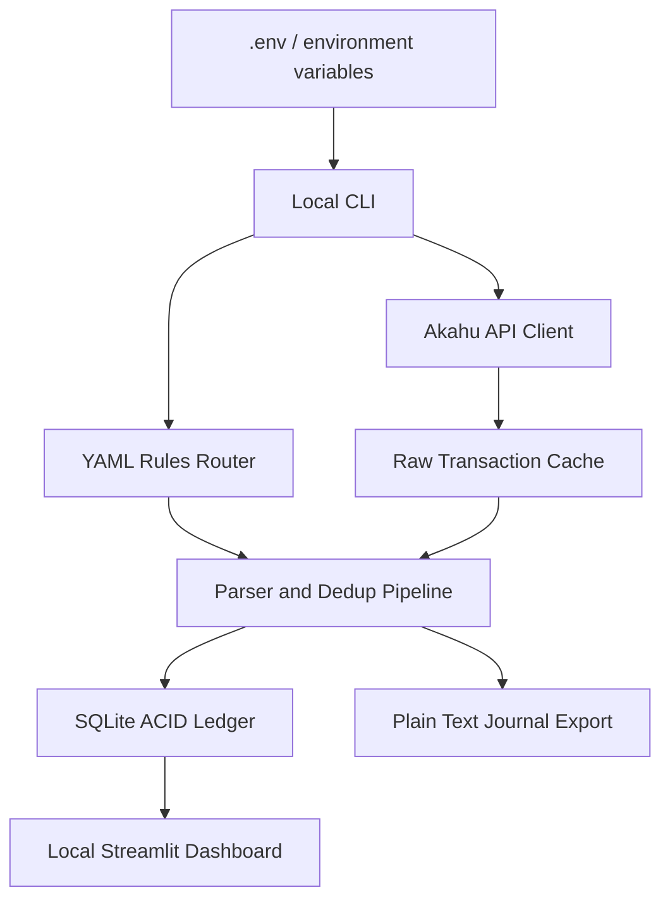

# Phase 1 Architecture Design Document (Historical)

> **Note**: This document describes the legacy Python CLI + SQLite architecture from Phase 1. It has been superseded by the Supabase-backed TanStack Start frontend (Phase 3+). For the current architecture and deployment model, see [`frontend/CLAUDE.md`](../frontend/CLAUDE.md). This document is preserved as a historical reference for understanding the previous system design.

## 1. Overview

This project is a local-first Personal ERP and Open Finance ledger engine for Akahu/BNZ transaction ingestion, deterministic deduplication, double-entry posting, plain-text accounting export, and local BI reporting.

The system is designed around five non-negotiable properties:

1. **Zero-trust local execution**: secrets are loaded only from `.env` or process environment variables. No credentials are committed or hardcoded.
2. **Idempotent ingestion**: every raw transaction is keyed by Akahu `_id` when available, with a deterministic fallback hash for immutable raw fields.
3. **Strict double-entry integrity**: every journal transaction must balance exactly before it is committed or exported.
4. **Declarative routing rules**: classification rules live in YAML and are loaded at runtime on every pipeline run, so edits do not require code changes or process restarts.
5. **NZ/Open Banking compatibility**: the data model preserves Akahu account IDs, transaction states, merchant metadata, and NZFCC category fields for fallback classification.

## 2. Stack Choice

### Chosen stack: Python 3.11+

Reasoning:

- Python has first-class support for financial scripting, local automation, SQLite, data analysis, and Streamlit dashboards.
- SQLite is built into Python and provides a reliable ACID local ledger without a separate database server.
- YAML rules are easy for non-developers to maintain.
- The resulting system can run locally from cron, Docker, launchd, or a home server without cloud dependencies.

### Key libraries

- `requests`: Akahu REST API client.
- `python-dotenv`: optional local `.env` loading.
- `PyYAML`: declarative rules.
- `streamlit`: local BI dashboard.
- `pytest`: validation tests.

## 3. Runtime Boundaries



No remote persistence is used by default. Live Akahu calls happen only when the user supplies valid local credentials.

## 4. Database Schema

SQLite is the default ACID persistence layer. PostgreSQL could later be added behind the same persistence interface, but SQLite is intentionally selected for local-first operation.

```sql
CREATE TABLE raw_transactions (
    id INTEGER PRIMARY KEY AUTOINCREMENT,
    akahu_transaction_id TEXT,
    idempotency_hash TEXT NOT NULL UNIQUE,
    account_id TEXT NOT NULL,
    status TEXT NOT NULL,
    amount_cents INTEGER NOT NULL,
    currency TEXT NOT NULL DEFAULT 'NZD',
    transaction_date TEXT NOT NULL,
    settlement_date TEXT,
    description TEXT NOT NULL,
    merchant_name TEXT,
    nzfcc TEXT,
    raw_json TEXT NOT NULL,
    first_seen_at TEXT NOT NULL,
    last_seen_at TEXT NOT NULL,
    processed_at TEXT,
    skipped_reason TEXT,
    UNIQUE(akahu_transaction_id)
);

CREATE TABLE journal_transactions (
    id INTEGER PRIMARY KEY AUTOINCREMENT,
    external_id TEXT NOT NULL UNIQUE,
    transaction_date TEXT NOT NULL,
    description TEXT NOT NULL,
    source_account_id TEXT NOT NULL,
    status TEXT NOT NULL,
    rule_id TEXT,
    created_at TEXT NOT NULL
);

CREATE TABLE journal_entries (
    id INTEGER PRIMARY KEY AUTOINCREMENT,
    journal_transaction_id INTEGER NOT NULL REFERENCES journal_transactions(id) ON DELETE CASCADE,
    account TEXT NOT NULL,
    side TEXT NOT NULL CHECK(side IN ('debit', 'credit')),
    amount_cents INTEGER NOT NULL CHECK(amount_cents > 0),
    currency TEXT NOT NULL DEFAULT 'NZD'
);

CREATE TABLE sync_state (
    key TEXT PRIMARY KEY,
    value TEXT NOT NULL,
    updated_at TEXT NOT NULL
);
```

Integrity checks are enforced in application code before commit:

- Sum of debits must equal sum of credits.
- Each journal transaction must have at least one debit and one credit.
- Amounts are stored as integer cents to avoid floating point drift.
- `external_id` maps to the raw transaction idempotency key and is unique.

## 5. Duplicate Posting Prevention

The ingestion pipeline prevents duplicate ledger postings at three layers:

1. **Raw cache uniqueness**:
   - Prefer Akahu `_id` as immutable identifier.
   - If `_id` is absent, compute a SHA-256 hash of immutable fields:
     `account_id | raw date | exact amount | raw description | merchant name`.
2. **Journal uniqueness**:
   - `journal_transactions.external_id` is unique and derived from the raw idempotency key.
3. **Transactional commit**:
   - Raw persistence and journal posting occur inside SQLite transactions where possible.

This means re-pulling the same API window, including over Akahu's 48-hour description/settlement adjustment period, updates raw observation metadata but does not create duplicate ledger entries.

Pending transactions are not frozen into the ledger by default. They are cached in `raw_transactions` with `skipped_reason='pending'` so the dashboard/auditor can inspect them, but no double-entry journal is posted until a settled version is seen.

## 6. Declarative Rules Engine Format

Rules are loaded from `config/rules.yaml` on every CLI command invocation. A future long-running daemon can reload by file mtime before each batch.

```yaml
defaults:
  currency: NZD
  suspense_account: Expenses:Uncategorized:Suspense

account_mappings:
  acc_bnz_cash_example:
    ledger_account: Assets:BNZ:Cash
    account_type: asset
  acc_bnz_visa_example:
    ledger_account: Liabilities:BNZ:AdvantageVisa
    account_type: liability

nzfcc_mappings:
  utilities:
    target_account: Expenses:OpEx:Utilities

rules:
  - id: spark_saas
    priority: 10
    match:
      description_regex: "(?i)spark|spark nz"
      merchant_regex: "(?i)spark"
      account_ids: [acc_bnz_cash_example]
    route:
      target_account: Expenses:OpEx:Software:SaaS
      memo: Spark SaaS / telecommunications

  - id: capital_asset_large_purchase
    priority: 20
    match:
      amount_greater_than: 1000.00
      description_regex: "(?i)apple|pb tech|computer|laptop"
    route:
      target_account: Assets:Equipment:Computer

  - id: salary_income
    priority: 30
    match:
      amount_greater_than: 0
      description_regex: "(?i)salary|payroll|wages"
    route:
      target_account: Income:Active:Salary
```

Rules are evaluated by ascending `priority`, then declaration order. If no rule matches, the transaction routes to the configured suspense account.

## 7. Akahu / NZ-Specific Handling

The raw transaction model preserves:

- Akahu account IDs such as `acc_bnz_...`.
- Akahu transaction `_id`.
- `status` / `state` to distinguish pending from settled.
- Raw terminal description and cleaned merchant names.
- NZFCC values for fallback category mapping.

The pipeline uses rules first, NZFCC fallback second, and suspense last.

## 8. Plain Text Accounting Export

The SQL ledger is the source of truth. PTA export appends or rewrites clean hledger-compatible `.journal` entries from SQL:

```journal
2026-06-22 SPARK NZ LTD AUCKLAND NZ ; akahu:txn_123 rule:spark_saas
    Expenses:OpEx:Software:SaaS         NZD 89.99
    Assets:BNZ:Cash                    NZD -89.99
```

SQL journal entries remain balanced as debits/credits. The hledger export renders positive amounts for debits and negative amounts for credits.

## 9. Module Design

- `ingest_service`: Akahu API client, pagination, rate limiting, HTTP error handling, mock transaction loading.
- `ledger_pipeline`: raw parsing, deterministic idempotency keys, pending handling, balanced journal construction.
- `rules_router`: YAML rules loader and classifier.
- `persistence_layer`: SQLite DDL, raw cache, double-entry posting, PTA export.
- `bi_reporting`: Streamlit dashboard reading from SQLite.
- `cli`: local commands for sync, rules dry-run, export, and dashboard launch.

## 10. Operational Model

Example local-only commands:

```sh
cp .env.example .env
python -m youinc_ledger.cli init-db
python -m youinc_ledger.cli sync --mock-file tests/fixtures/akahu_transactions.json
python -m youinc_ledger.cli rules-test --mock-file tests/fixtures/akahu_transactions.json
python -m youinc_ledger.cli export-journal --output ledger.journal
python -m streamlit run src/youinc_ledger/bi_reporting/dashboard.py
```

For cron/home-server usage, run `sync` on a schedule with `.env` loaded locally. Secrets remain outside source control.
