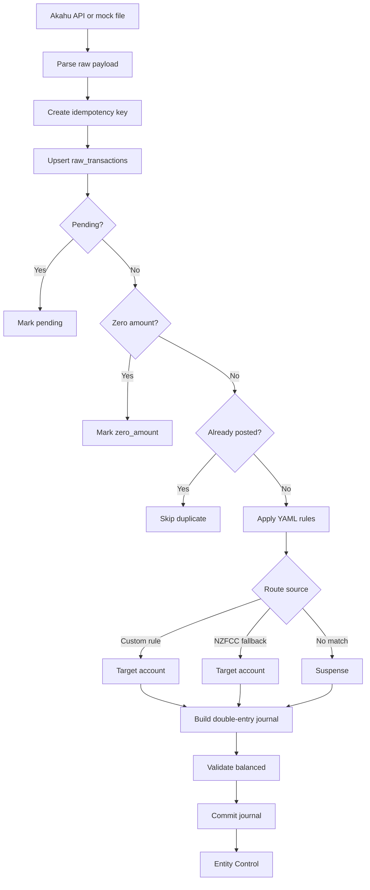

# YouInc Internal System Design

## Product stance

YouInc is an internal finance operating system. It should not feel like a landing page, consumer budgeting app, or marketing site.

The interface should feel like something a large company would use internally: stark, dense, precise, low-emotion, and decision-grade.

## Operator model

The user is not browsing a product. The user is operating an entity.

| Operator requirement | System implication |
| --- | --- |
| Wants emotional distance from personal money | Use entity, ledger, treasury, runway, burn, obligations, exceptions. Avoid motivational or marketing copy. |
| Wants strategic control | Lead with status, exceptions, and allocation posture. |
| Trusts numbers over narrative | Use compact KPIs, tables, source status, and audit trails. |
| Thinks like both employee and executive | Treat life funding as burn/salary floor and surplus as allocation capacity. |
| Needs confidence before decisions | Make suspense, ingestion state, and classification rate first-class system signals. |

## Interface principles

1. **No landing-page structure**: no hero, no promotional copy, no persona card in the app UI.
2. **System-first header**: product name, current module, ledger status, generated timestamp, raw/posted counts.
3. **Exceptions before insight**: if the books are not decision-grade, show that before analysis.
4. **Dense information hierarchy**: panels, tables, mono labels, compact KPIs.
5. **Flat visual language**: borders, neutral background, minimal color reserved for status.
6. **No guilt language**: spending is burn, obligations, capex, draw, or suspense.
7. **Auditability**: every number should trace back to source accounts, raw ingestion, rules, and journal entries.

## Current frontend modules

### 1. Entity Control header

Displays:

- Ledger state: `ONLINE` / `NO DB`.
- Generated timestamp.
- Raw transaction count / posted journal count.

Purpose: establish that this is an operating console connected to a local ledger.

### 2. Control Brief

A compact status block derived from ledger health.

Decision logic:

1. No database → `BLOCKED`.
2. Suspense exists → `EXCEPTION`.
3. Runway below threshold → `PRESERVE`.
4. Retained surplus exists → `ALLOCATE`.
5. Otherwise → `MONITOR`.

This is not marketing copy. It is a management control state.

### 3. KPI strip

Current metrics:

- Net Worth.
- Runway.
- Burn / Mo.
- Margin.
- Assets.
- Liabilities.

These are entity facts, not personal finance encouragement.

### 4. Operating Statement

P&L trend by month.

Mapping:

- `Income:*` → revenue.
- `Expenses:*` → burn.
- EBITDA → retained operating surplus.

### 5. Ledger Confidence

Decision-grade status for classification.

Metrics:

- Classification rate.
- Custom rules.
- NZFCC fallback.
- Suspense count.
- Suspense value.

Suspense is treated as an exception state because it means the entity has transactions without management interpretation.

### 6. Ingestion

Operational health of the data supply chain.

Metrics:

- Raw cache.
- Posted.
- Pending.
- Zero amount.
- Unprocessed.
- Window start/end.
- Last seen.
- SQLite path.
- Sync state.

### 7. Balance Sheet

Double-entry account balances grouped by account type.

### 8. Source Systems

Bank/source account summary. This answers: what systems are feeding the ledger and how fresh are they?

### 9. Journal

Recent posted business events with rule ID and postings. This is the audit trail, not a transaction feed for browsing.

## Information data model

The current SQLite model supports the internal system model.

### `raw_transactions`

Raw intake layer.

Product meaning:

- Raw cached count = ingestion reach.
- Pending count = known but not board-approved yet.
- Unprocessed count = pipeline attention needed.
- Last seen date = freshness.

### `journal_transactions`

One balanced business event per posted raw transaction.

Product meaning:

- Posted journals = decision-grade records.
- `rule_id` = management interpretation source.
- `null rule_id` = suspense / missing interpretation.

### `journal_entries`

Debit/credit postings.

Product meaning:

- `Assets:*` = treasury/capital base.
- `Liabilities:*` = obligations.
- `Income:*` = revenue.
- `Expenses:*` = burn/operating cost/suspense.

### `sync_state`

Operational freshness layer.

Product meaning:

- Last successful sync marker.
- Account/window-specific delta state.
- Future stale-data warnings.

## Ingestion process

## Next system-level functionality

1. **Suspense resolution console**: convert unresolved journal events into proposed `config/rules.yaml` changes.
2. **Owner compensation model**: baseline salary floor, target salary, discretionary draw.
3. **Allocation ledger**: surplus allocation to runway, debt, assets, investment, education, health.
4. **Board close workflow**: month-end snapshot, exceptions, decision notes, locked report.
5. **Scenario planner**: burn/revenue/debt/runway sensitivity model.
6. **Freshness controls**: stale sources, failed sync windows, unresolved pending records.
